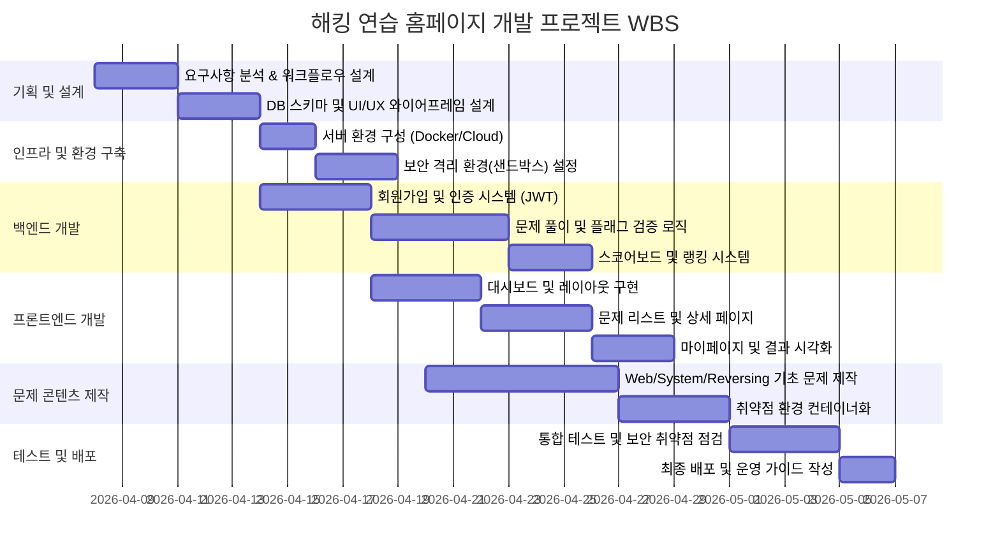

# vibe

```mermaid
gantt
    title 해킹 연습 홈페이지 개발 프로젝트 WBS
    dateFormat  YYYY-MM-DD
    section 기획 및 설계
    요구사항 분석 & 워크플로우 설계       :a1, 2026-04-08, 3d
    DB 스키마 및 UI/UX 와이어프레임 설계  :after a1, 3d
    
    section 인프라 및 환경 구축
    서버 환경 구성 (Docker/Cloud)        :b1, 2026-04-14, 2d
    보안 격리 환경(샌드박스) 설정         :after b1, 3d
    
    section 백엔드 개발
    회원가입 및 인증 시스템 (JWT)        :c1, 2026-04-14, 4d
    문제 풀이 및 플래그 검증 로직         :c2, after c1, 5d
    스코어보드 및 랭킹 시스템             :c3, after c2, 3d
    
    section 프론트엔드 개발
    대시보드 및 레이아웃 구현             :d1, 2026-04-18, 4d
    문제 리스트 및 상세 페이지            :d2, after d1, 4d
    마이페이지 및 결과 시각화             :d3, after d2, 3d
    
    section 문제 콘텐츠 제작
    Web/System/Reversing 기초 문제 제작 :e1, 2026-04-20, 7d
    취약점 환경 컨테이너화                :after e1, 4d
    
    section 테스트 및 배포
    통합 테스트 및 보안 취약점 점검       :f1, 2026-05-01, 4d
    최종 배포 및 운영 가이드 작성         :f2, after f1, 2d
```
